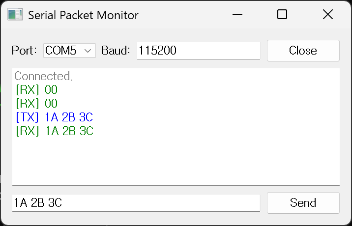

# py-serial-qt



A PyQt-based serial packet communication GUI

This application provides a clean interface for sending and receiving space-separated hexadecimal packets via a serial connection. It's useful for debugging or interacting with serial devices using a byte-level protocol.

- TX (transmit) logs appear in **blue**
- RX (receive) logs appear in **green**
- Input correction included: removes `0x`, capitalizes, filters invalid values
- Clean modular architecture with separated GUI and serial logic

---

## Project Structure

```bash
├── LICENSE
├── README.md
├── docs
│   └── img
│       ├── gui_clean.png
│       └── gui_example.png
├── main.py
├── pyproject.toml
├── pytest.ini
├── requirements-dev.txt
├── requirements.txt
├── src
│   └── serial_gui
│       ├── core
│       │   ├── __init__.py
│       │   └── serial_handler.py
│       └── gui
│           ├── __init__.py
│           ├── port_combo_box.py
│           └── serial_gui.py
└── tests
    ├── test_serial_gui.py
    └── test_serial_handler.py
```

---

## Installation & Usage

### Use Poetry (Recommended)

1. Install Poetry (if not already installed):

```bash
## Windows
pip install poetry

## Linux
pip3 install poetry
```

2. Install dependencies:

```bash
poetry install
```

3. Run tests: (optional)

```bash
poetry run pytest
```

4. Run the GUI:

```bash
poetry run python main.py
```

Or if you define a script alias in `pyproject.toml`:

```bash
poetry run serial-gui
```

### Default

1-1. install dependancy (For Runtime Only)

```bash
pip install -r requirements.txt
```

1-2. install dependancy (For Development (runtime + testing))

```bash
pip install -r requirements-dev.txt
```

2. run tests: (optional)

```bash
pytest
```

3. Run the GUI:

```bash
python main.py
```

---

## Testing

Unit and GUI tests are defined using `pytest` and `pytest-qt`.

- `serial_handler.py`: tested using a dummy serial mock (no real hardware required)
- `serial_gui.py`: tested for GUI behavior, logging, input correction

Run tests:

```bash
poetry run pytest
```

---

## License

This project is licensed under the MIT License.
